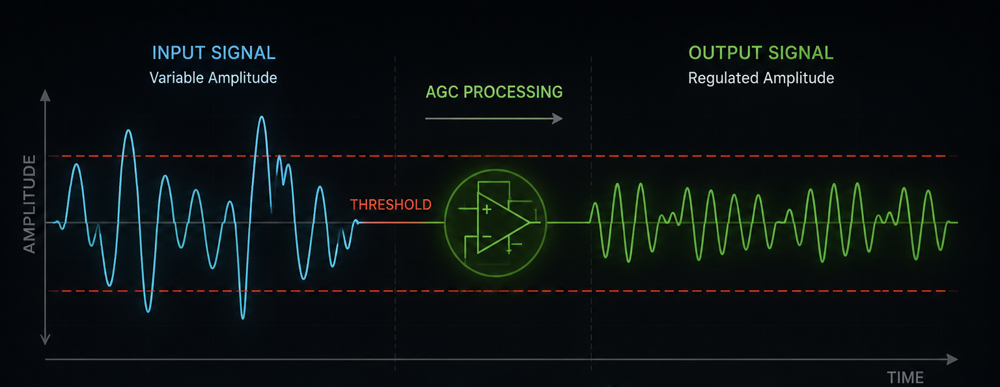
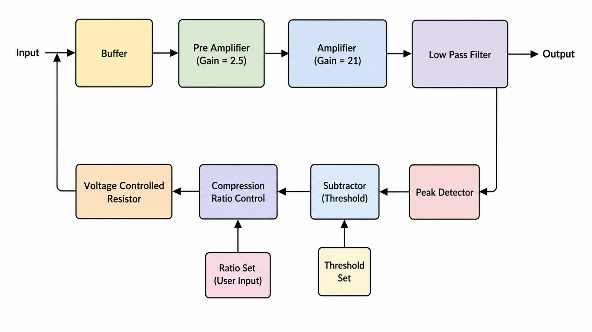
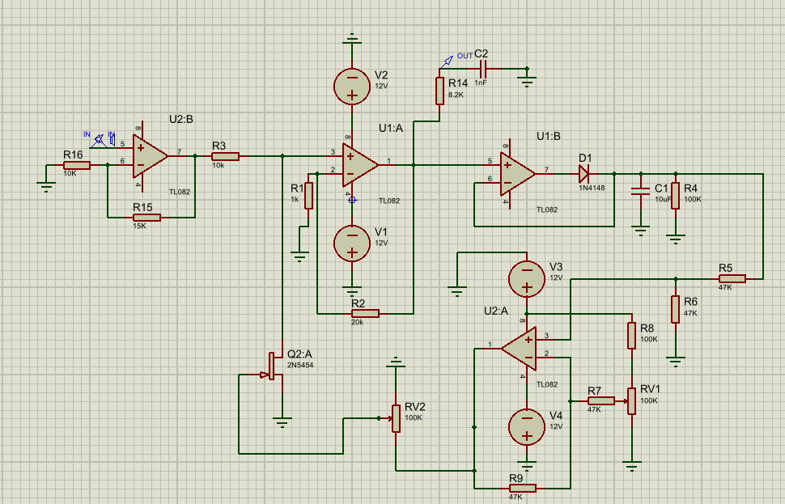
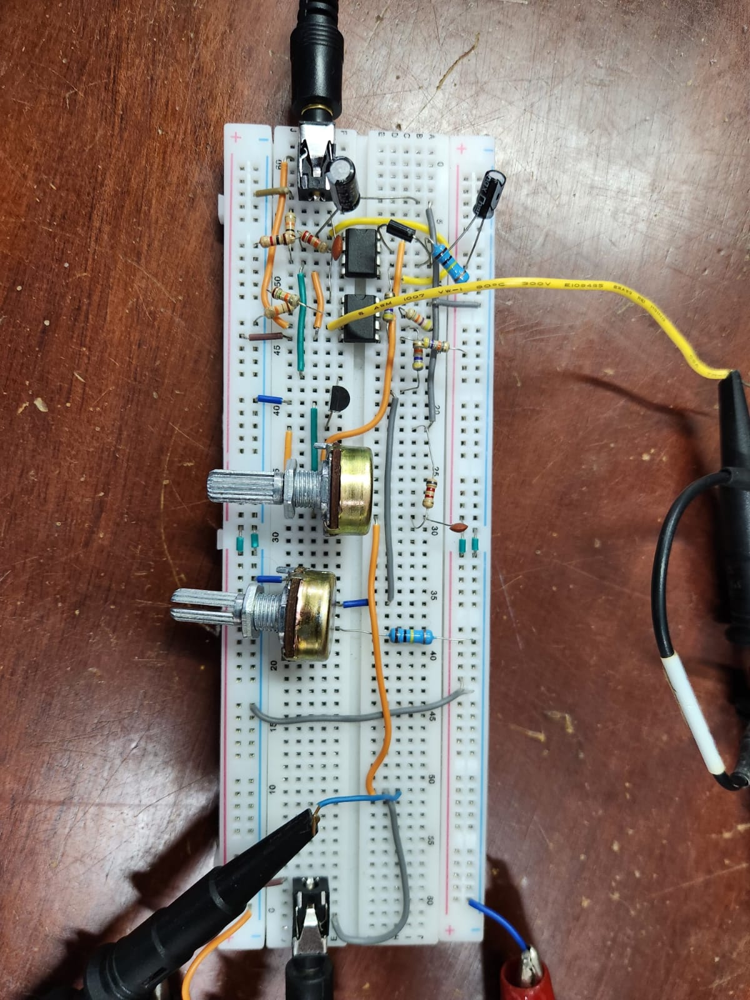
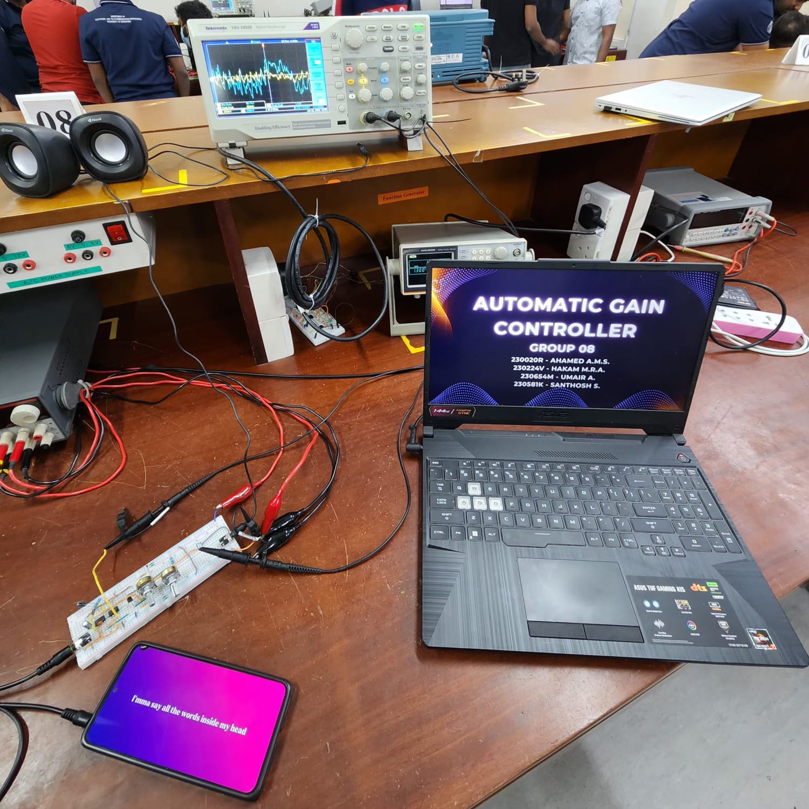
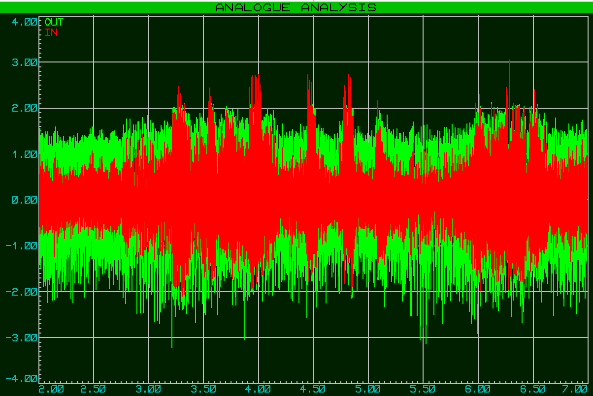
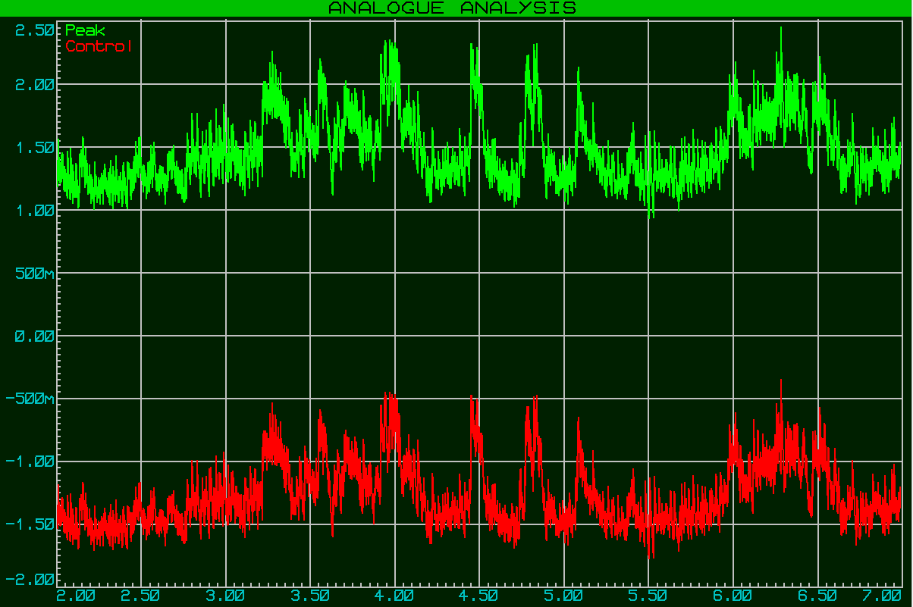
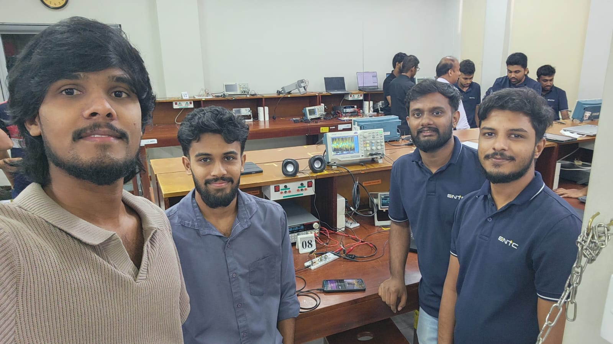

# Automatic Gain Controller

<p align="center">
  
</p>


This repository contains the project files for our **Automatic Gain Controller (AGC)** project. The project focuses on designing, simulating, building, and testing an analog audio AGC circuit.

The circuit keeps the output audio level more stable when the input signal level changes. It uses op-amps for buffering and amplification, and a JFET as a voltage-controlled resistor for gain control.

---

## Project Summary

In many audio systems, the input signal is not constant. For example, a phone output, microphone signal, or recorded audio can change in level. If the input is too low, the output becomes weak. If the input is too high, the output can clip or distort.

To reduce this problem, this project uses an Automatic Gain Controller. When the input signal is weak, the circuit increases the gain. When the input signal is high, the circuit reduces the gain. This helps to keep the output level nearly constant.

---

## Main Features

- Analog AGC design for audio signals
- Input buffer to reduce loading effect
- Pre-amplifier stage for weak signals
- Main amplifier stage
- Peak detector for output level sensing
- Threshold setting
- Compression ratio control
- JFET-based voltage-controlled resistor
- Simulation and hardware testing
- Real audio testing using a mobile phone and speaker

---

## Main Components

| Component | Purpose |
|---|---|
| NE5532 operational amplifier | Buffering, pre-amplification, amplification, and control circuit stages |
| 2N5457 JFET | Voltage-controlled resistor for gain control |
| 1N4148 diode | Peak detector circuit |
| Resistors and capacitors | Gain setting, coupling, filtering, and biasing |
| 100 kΩ potentiometers | Threshold and compression ratio settings |
| Audio jack | Phone/audio input connection |
| Dual power supply | Circuit power supply |

---

## System Design

The AGC system has two main paths.

### Forward Signal Path

```text
Input → Buffer → Pre-Amplifier → Amplifier → Low Pass Filter → Output
```

### Feedback Control Path

```text
Amplifier output → Peak Detector → Subtractor → Compression Ratio Control
→ Voltage Controlled Resistor → Signal path before amplifier
```

---

## Block Diagram

<p align="center">
  
</p>

The block diagram shows the main audio path and the feedback path used for automatic gain control.

---

## Circuit Schematic

<p align="center">
  
</p>

The schematic shows the complete AGC circuit with op-amp stages, peak detector, control path, and JFET-based gain control section.

---

## Hardware Implementation

<p align="center">
  
</p>

The circuit was first implemented on a breadboard. Each stage was tested separately before testing the full AGC circuit.

---

## Project Evaluation Setup

<p align="center">
  
</p>

The project was tested using real audio input and measurement equipment. The output waveform was observed using an oscilloscope, and the sound output was checked using a speaker.

---

## Simulation

The circuit was simulated in **Proteus** before hardware implementation. Simulation was used to verify whether the AGC circuit could amplify weak input signals, reduce strong input signals, and generate a proper control voltage.

### Proteus Captures

#### Audio Input and Output

<p align="center">
  
</p>

This capture shows the relationship between the audio input and output signals in the simulation.

#### Peak and Control Voltage

<p align="center">
  
</p>

This capture shows the detected peak signal and the generated control voltage used for automatic gain control.

### Proteus Project Files

The main simulation files are stored in the `simulation/proteus` folder. These include:

- `AGC.pdsprj`
- `AGC [Autosaved].pdsprj`
- project backup files inside `Project Backups/`

These files can be used to open, review, and modify the Proteus simulation of the AGC circuit.

---

## Testing

The circuit was tested using a function generator and also using real audio from a mobile phone. The output was observed on an oscilloscope. A speaker was also connected to check the sound output.

During testing, the gain increased for weak input signals and reduced for stronger input signals. The output was not perfectly constant, but it was more stable than a normal fixed-gain amplifier.

---

## Performance Summary

| Parameter | Value |
|---|---|
| Input voltage range | 40 mV to 2 V |
| Output voltage range | 2 V to 10 V |
| Maximum gain | 100 |
| Minimum gain | 2.5 |
| Control voltage range | -6 V to 0 V |
| Frequency response | 100 Hz to 18 kHz |
| Noise level | Low |
| Clipping condition | No clipping under normal operation |
| Output/Input variation ratio | 1/100 |

---

## Bill of Materials

The BOM file is available in:

```text
docs/AGC_BOM.xlsx
```

It contains the main components used for the AGC circuit, including op-amps, JFET, diode, resistors, capacitors, potentiometers, and other hardware parts.

---

## Project Report

The final project report is available in the `docs` folder.

```text
docs/
```

---

## Demonstration Video

The demonstration video link can be found in:

```text
media/videos/DEMO.md
```

---

## Repository Structure

```text
automatic-gain-controller/
├── README.md
├── .gitignore
├── docs/
│   ├── AGC_BOM.xlsx
│   └── G08_Automatic_Gain_Controller...
├── hardware/
│   ├── breadboard/
│   │   └── AGC_Breadboard_Top.jpeg
│   └── schematics/
│       └── AGC_Circuit.png
├── media/
│   ├── images/
│   │   ├── Group_selfie.jpeg
│   │   ├── Project_evaluation_setup.jpeg
│   │   ├── agc_block_diagram.png
│   │   └── agc_thumbnail.png
│   └── videos/
│       └── DEMO.md
├── references/
│   └── references.md
└── simulation/
    └── proteus/
        ├── Captures/
        │   ├── Audio_in_and_out.png
        │   └── peak_and_control.png
        ├── Project Backups/
        ├── AGC.pdsprj
        └── AGC [Autosaved].pdsprj
```

---

## Folder Details

| Folder | Content |
|---|---|
| `docs` | Final report and BOM file |
| `hardware/schematics` | AGC circuit schematic |
| `hardware/breadboard` | Breadboard implementation photo |
| `media/images` | Thumbnail, block diagram, group photo, and evaluation setup images |
| `media/videos` | Demonstration video link |
| `references` | Datasheets, websites, and project references |
| `simulation/proteus` | Proteus simulation files, captures, and backups |

---

## Team

<p align="center">
  
</p>

**Group 08**  
Department of Electronics and Telecommunication Engineering  
University of Moratuwa

---

## License

This project is for academic and learning purposes.
